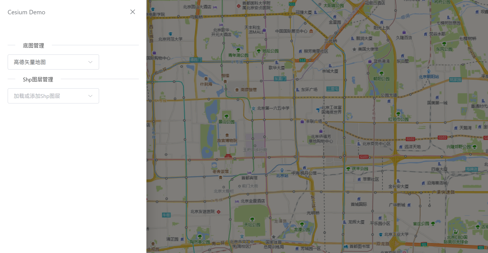

# YOYOGeoViewer

由 Vue3 + TypeScript + Cesium 构建的地理信息可视化工具。

## 1 功能

已实现的功能

- ✅ **多底图切换**：支持高德矢量地图和高德影像地图。
- ✅ **建筑模型显示**：支持
- ✅ **Shp文件显示**：支持本地Shp文件的上传与显示。由于Cesium性能限制，建议只上传行政区类的数据量较小的Shp。
- ✅ **散点图渲染**：支持从Excel文件中读取海量点数据并渲染。
- ✅ **OD线渲染**：支持从Excel文件中读取海量OD数据并渲染。
- ✅ **高清化显示**：满足部分场景下的高清显示需求。

待实现的功能
- ⭕️ 自定义底图及多样式底图
- ⭕️ 自定义建筑模型数据源
- ⭕️ 自定义散点及OD线样式
- ⭕️ 热力图及三维热力图
- ⭕️ 运行轨迹图




## 2 部署

1. 克隆仓库

```shell
git clone https://github.com/YOYOYOAKE/YOYOGeoViewer.git
```

2. 切换至项目文件夹内，使用`pnpm`安装项目依赖。（需要`Node.js`>=18）

```shell
npm -g install pnpm
pnpm install
```

3. 启动项目。

```shell
pnpm run dev
```

4. 在浏览器中输入地址`http://localhost:5173`访问YOYOGeoViewer。
